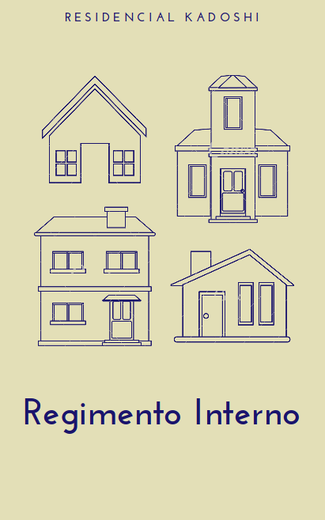

--- 
knit: "bookdown::render_book"
title: "REGIMENTO INTERNO DO RESIDENCIAL KADOSHI"
subtitle: "O corpo administrativo do Residencial Kadoshi atualmente é formato por:"
author: "**Síndico(a)**: Emanuelle W. A. de Farias   **E-mail**: <emanuelle.w@hotmail.com> ou <pedro.rafael.marinho@gmail.com>   **Subsíndico**: Hugo H. L. de Araujo"
site: bookdown::bookdown_site
output: bookdown::gitbook
documentclass: book
always_allow_html: yes
url: 'https://prdm0.github.io/aulas_computacional/'
github-repo: prdm0/aulas_computacional
link-citations: yes
colorlinks: yes
fontsize: 13pt
monofont: "Source Code Pro"
description: "Regimento Interno"
---

# {-}

**Última atualização do site**: 14/06/2019  

---

---

# Prefácio {-}

Nesse site estão descritas as regras adotadas para compor o **Regimento Interno do Residencial Kadoshi**. Todas as nomativas estão anotadas em ata e registradas em cartório.

Esse site visa também ajudar os condôminos que estejam cedendo ou alugando sua(s) unidade(s) autônoma(s) à compartilhar as nomas que devem ser seguidas na íntegra pelos novos moradores.

**Nota**: 

\BeginKnitrBlock{rmdnote}

As regras aqui descritas foram aprovadas no dia 27 (vinte e sete) do mês março do ano de 2019. A Assembleia Geral Ordinária do Condomínio Residencial, situado à Rua Desembargador José de Farias, n° 237, Altiplano Cabo Branco – João Pessoa/PB, iniciou-se às 20h00min, em segunda e última convocação. 

\EndKnitrBlock{rmdnote}

# Artigos {-}

## Art. 1 {-}

Obrigam-se ao estrito cumprimento deste Regimento Interno, os proprietários, promitentes compradores, cessionários ou promitentes cessionários, todos doravante chamados de condôminos, locatários e agregados. Parágrafo Único. São considerados agregados, para o efeito desse Regimento Interno, os familiares, hóspedes, visitantes, empregados domésticos e demais funcionários contratados para realização de serviços internos às unidades. 

## Art. 2 {-}

Aliado do que diz o Art. 1 do presente Regimento Interno, os condôminos deverão se atentar e fazer cumprir o que diz a Escritura Particular de Convenção do Condomínio, documento este prenotado no Protocolo 1-Z sob n. 303.998, pg. 114V, Registro Livro 2BT folhas 24, ordem R-5-29.649, no Cartório Eunápio Torres, João Pessoa, Paraíba - PB, em 19 de setembro de 2017.

> **Parágrafo Único**. As advertências serão formalizadas tendo como base o presente Regimento Interno e/ou a Escritura Particular de Convenção do Condomínio, bem como poderá levar em consideração o Código Civil Brasileiro.

## Art. 3 {-}

A violação de qualquer um dos deveres e normas estipulados no presente Regimento Interno e/ou Escritura Particular de Convenção do Condomínio, bem como violações do Código Civil Brasileiro que comprometa a convivência em condomínio, sujeitará o condômino infrator (proprietário do imóvel, em caso de imóvel alugado ou cedido) ao pagamento de multa(s). As penalidades previstas (aprovadas em Assembleia Geral) devido ao descumprimento de alguma das normas serão cobradas da seguinte forma:

  1. Na primeira infração o condômino receberá uma advertência, que será sempre escrita, assinada pelo síndico(a) e subsíndico(a), com a entrega pelos correios, com AR (aviso de recebimento) ou por e-mail. O condômino terá o prazo de 05 (cinco) dias úteis para apresentar uma defesa, que será analisada pelos membros do conselho fiscal/consultivo. Esta defesa, para ser considerada válida deverá ser documentada com cópias entregues aos membros do conselho fiscal/consultivo com argumentação embasando-se no referido regimento interno. As cópias deverão ser entregues com folhas numeradas e assinadas pelo proprietário do imóvel e/ou infrator. O boleto da multa será gerado após o julgamento da defesa;
  
  2. Em caso de reincidência o infrator/proprietário receberá a segunda advertência informando-o da multa no valor de 50% (cinquenta por cento) da cota condominial, que **virá junto à taxa de condomínio**.
  
  3. Caso seja necessário uma terceira advertência pelo mesmo motivo, esta virá com uma multa de 01 (uma) cota condominial no valor vigente à época da aplicação da multa. Para o caso de 03 (três) advertências distintas, ou seja, 03 (três) infrações por motivos diferentes, será aplicada uma multa que será informada na terceira advertência, correspondente a 50% (cinquenta por cento) do valor da cota condominial. O condômino zera a contagem de multas aplicadas, a cada 02 (dois) anos, a contar da data da terceira advertência.
  
> **Parágrafo Único**. Dentro do período de 02 (dois) anos, o condômino que receber uma multa de 01 (uma) cota condominial após a terceira notificação sempre será cobrado no valor de 01 (uma) cota condominial para o descumprimento futuro da mesma infração. Os cálculos de uma respectiva infração apenas serão zerados para infrações novas para o qual o condômino não foi eventualmente advertido. Para o caso de imóvel alugado e/ou cedido, a comunicação será feita em nome do proprietário do imóvel e caberá a este o pagamento da multa.

## Art. 4 {-}

A(s) multa(s) será(ão) encaminhada(s) para protesto após 30 (trinta) dias do seu vencimento. Além disso, tem-se: § 1º O condômino protestado concorrerá com todas as despesas de cartório; § 2º Se por ventura o condômino resgatar o título encaminhado para cartório antes do mesmo ser protestado, os juros e correções serão cobrados na taxa de condomínio do mês subsequente. 

## Art. 5 {-}

As taxas de condomínio serão geradas e enviadas pelo síndico e/ou administradora contratada, na forma de boleto bancário, com vencimento para o dia 10 (dez) de cada mês.

  + § 1º A(s) taxas(s) será(ão) encaminhada(s) para protesto após 30 (trinta) dias do seu vencimento;
  
  + § 2º Serão cobrados multa por atraso de 2,00% (dois por cento) mais 0,33% (zero vírgula trinta e três por cento) ao dia de atraso do pagamento da taxa de condomínio;
  
  + § 3º Com o atraso de 03 (três) cotas condominiais, ou seja, após 01 dia de vencida a terceira taxa, o condomínio entregará o caso para cobrança judicial;
  
  + § 4º O condômino com boleto protestado concorrerá com todas as despesas de cartório;
  
  + 5º Se por ventura o condômino resgatar o título encaminhado para cartório antes do mesmo ser protestado, os juros e correções serão cobrados na taxa de condomínio do mês subsequente;
  
  + § 6º As taxas de condomínio serão entregues pelo zelador e em caso de ausência do morador da unidade, os boletos serão colocados por baixo da porta da unidade autônoma, cabendo assim ao proprietário o dever de mensalmente tomar posse do documento para efetuar o pagamento;
  
  + § 7º Em caso de imóvel alugado ou cedido, o não pagamento da taxa de condomínio recairá sobre o proprietário do imóvel. É de inteira responsabilidade deste a fiscalização de quem faz uso de seu imóvel para a manutenção de todas as obrigações contidas nesse Regimento Interno e resoluções complementares;
  
  + § 8º Os boletos também poderão ser enviados eletronicamente para o e-mail do proprietário do imóvel. Sendo assim, é de obrigação do proprietário do imóvel manter o síndico e a administradora sempre atualizados com informações de e-mail(s), telefone(s) e endereço de residência, caso o proprietário não resida no condomínio.
  

## Art. 6 {-}
  
É obrigação do condômino se certificar que se encontra devidamente fechada/trancada a porta de vidro que dá acesso ao corredor térreo.
